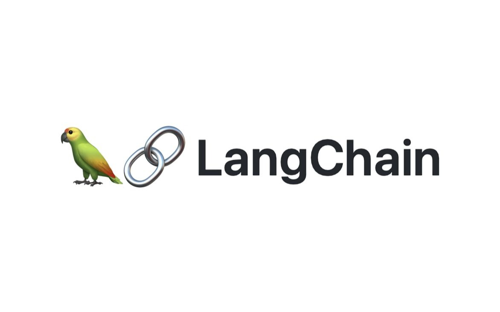
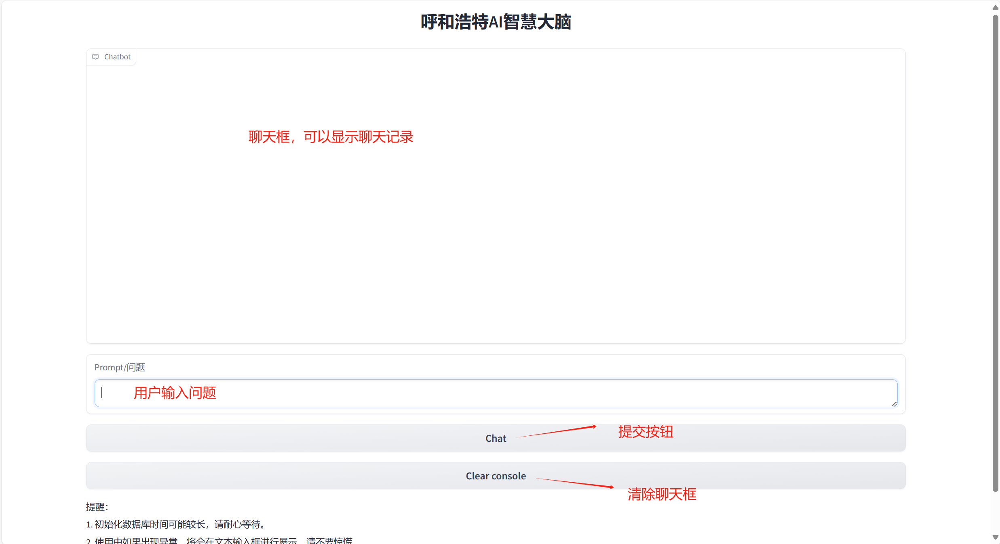
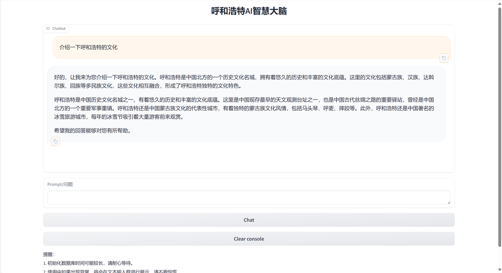
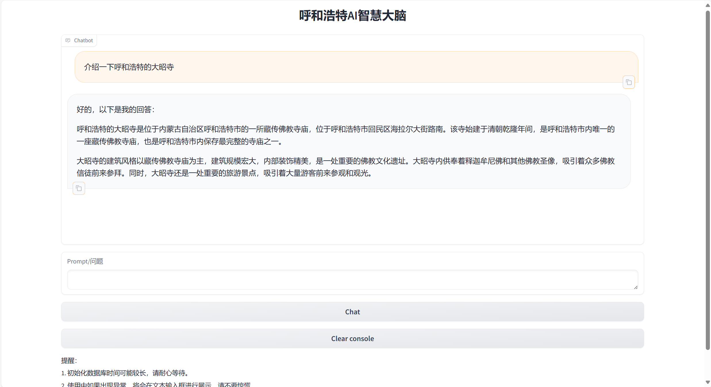
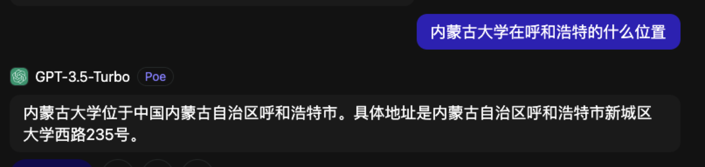
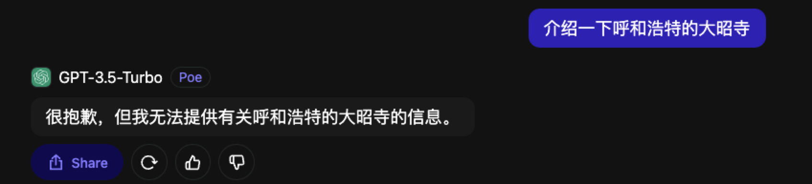

# HohhotBrain

## LLM-based Hohhot AI Smart Brain (基于大语言模型的呼和浩特AI智慧大脑)


<p align="center">
    
</p>


## 简介
近年来，随着人工智能技术的快速发展，其在各个领域展示出了巨大的潜力和应用前景。城市文化作为人类社会发展的重要组成部分，也开始逐渐受到人工智能技术的关注。城市文化是城市的灵魂，是城市与其他地区的差异和特色所在。它包括城市的历史文化、传统艺术、地方美食、民俗习惯等各个方面的内容。传承和发展城市文化对于城市的可持续发展和提升城市形象具有重要意义。另外，大语言模型是一种基于深度学习技术的自然语言处理模型，它可以通过大量的语料库数据进行训练，从而具备了强大的语义理解和生成能力。这种模型可以自动分析和生成与自然语言相关的内容，如文章、对话、翻译等。基于大语言模型的城市文化AI模型的开发旨在利用人工智能技术，推动城市文化的数字化转型和创新。通过对大量城市文化数据进行训练和分析，模型可以深入挖掘和理解城市的历史文化、传统艺术以及与城市相关的各种文化元素。可以自动生成与城市文化相关的文章、推荐旅游景点、介绍地方特色等内容，为城市规划、旅游推广、文化交流等领域提供重要的智能化解决方案。

基于此，本项目通过深入研究呼和浩特城市的历史、文化和社会特点，收集整理大规模的呼和浩特文化旅游相关的训练数据，结合大规模数据的训练和模型的优化，实现了“基于大语言模型的呼和浩特AI智慧大脑”。该模型可以更好地理解呼和浩特城市文化的内涵和特点，为呼和浩特城市的文化传承和发展提供重要的支持和指导。

综上，“基于大语言模型的呼和浩特AI智慧大脑”的推出将为呼和浩特城市文化研究和传播带来新的机遇和挑战。它有助于加快呼和浩特城市文化的数字化进程，提升城市形象和品牌价值，促进城市的可持续发展和国际交流。同时，它也为人们提供了更便捷和个性化的城市文化体验和服务，提高了城市文化的普及度和影响力。


本项目基于Langchain为基础，结合LLM大语言模型，并以丰富的呼和浩特城市数据为基础构建了本地问答知识库来宣传呼和浩特的城市文化。
* LangChain是一个基于大语言模型（如ChatGPT）用于构建端到端语言模型应用的Python框架。[Langchain](https://github.com/langchain-ai/langchain)    
* 经过百万规模心理咨询领域中文长文本指令与多轮共情对话数据联合指令微调的 [InternLM大语言模型](https://github.com/InternLM/InternLM)   

我们期望，**Langchain构建本地知识库** 可以帮助学术界加速大模型在特定区域文化宣传的研究与应用。
## 最近更新
- 👏🏻  2024.3.08：我们的 呼和浩特AI智慧大脑 正式发布！！！

   在学术界，一些研究团队开始尝试将Langchain的思想应用于本地知识库的构建。他们致力于通过构建知识图谱、整合领域专家知识等方式，建立起丰富的本地知识库，并结合大型语言模型进行问题回答。这些研究旨在提高问答系统对中文语境的理解和处理能力，使其能够更准确地回答用户的问题。本文就是基于Langchain框架构建本地的知识库并接入LLM模型来构建的一个基于语言模型的呼和浩特AI智慧大脑，助力呼和浩特文化宣传！
<p align="center">
    
</p>

我们选择了 [InternLM大语言模型](https://github.com/InternLM/InternLM) 作为底座大语言模型，进行了**本地知识库的接入**，旨在提升模型的针对呼和浩特地区的交流问答能力。之所以选择InternLM模型原因如下：
## Introduction

InternLM2 series are released with the following features:

- **200K Context window**: Nearly perfect at finding needles in the haystack with 200K-long context, with leading performance on long-context tasks like LongBench and L-Eval. Try it with [LMDeploy](./chat/lmdeploy.md) for 200K-context inference.

- **Outstanding comprehensive performance**: Significantly better than the last generation in all dimensions, especially in reasoning, math, code, chat experience, instruction following, and creative writing, with leading performance among open-source models in similar sizes. In some evaluations, InternLM2-Chat-20B may match or even surpass ChatGPT (GPT-3.5).

- **Code interpreter & Data analysis**: With code interpreter, InternLM2-Chat-20B obtains compatible performance with GPT-4 on GSM8K and MATH. InternLM2-Chat also provides data analysis capability.

- **Stronger tool use**: Based on better tool utilization-related capabilities in instruction following, tool selection and reflection, InternLM2 can support more kinds of agents and multi-step tool calling for complex tasks. See [examples](./agent/).

## Model Zoo

| Model                      | Transformers(HF)                           | ModelScope(HF)                           | OpenXLab(HF)                           | OpenXLab(Origin)                           | Release Date |
| -------------------------- | ------------------------------------------ | ---------------------------------------- | -------------------------------------- | ------------------------------------------ | ------------ |
| **InternLM2-1.8B**     | [🤗internlm2-1.8b](https://huggingface.co/internlm/internlm2-1_8b) | [ internlm2-1.8b](https://www.modelscope.cn/models/Shanghai_AI_Laboratory/internlm2-1_8b/summary) | [](https://openxlab.org.cn/models/detail/OpenLMLab/internlm2-base-1.8b) | [](https://openxlab.org.cn/models/detail/OpenLMLab/internlm2-base-1.8b-original) | 2024-01-31   |
| **InternLM2-Chat-1.8B-SFT**          | [🤗internlm2-chat-1.8b-sft](https://huggingface.co/internlm/internlm2-chat-1_8b-sft) | [ internlm2-chat-1.8b-sft](https://www.modelscope.cn/models/Shanghai_AI_Laboratory/internlm2-chat-1_8b-sft/summary) | [](https://openxlab.org.cn/models/detail/OpenLMLab/internlm2-chat-1.8b-sft) | [](https://openxlab.org.cn/models/detail/OpenLMLab/internlm2-chat-1.8b-sft-original) | 2024-01-31   |
| **InternLM2-Chat-1.8B**          | [🤗internlm2-chat-1.8b](https://huggingface.co/internlm/internlm2-chat-1_8b) | [ internlm2-chat-1.8b](https://www.modelscope.cn/models/Shanghai_AI_Laboratory/internlm2-chat-1_8b/summary) | [](https://openxlab.org.cn/models/detail/OpenLMLab/internlm2-chat-1.8b) | [](https://openxlab.org.cn/models/detail/OpenLMLab/internlm2-chat-1.8b-original) | 2024-02-19   |
| **InternLM2-Base-7B**      | [🤗internlm2-base-7b](https://huggingface.co/internlm/internlm2-base-7b) | [ internlm2-base-7b](https://modelscope.cn/models/Shanghai_AI_Laboratory/internlm2-base-7b/summary) | [](https://openxlab.org.cn/models/detail/OpenLMLab/internlm2-base-7b) | [](https://openxlab.org.cn/models/detail/OpenLMLab/internlm2-base-7b-original) | 2024-01-17   |
| **InternLM2-7B**           | [🤗internlm2-7b](https://huggingface.co/internlm/internlm2-7b) | [ internlm2-7b](https://modelscope.cn/models/Shanghai_AI_Laboratory/internlm2-7b/summary) | [](https://openxlab.org.cn/models/detail/OpenLMLab/internlm2-7b) | [](https://openxlab.org.cn/models/detail/OpenLMLab/internlm2-7b-original) | 2024-01-17   |
| **InternLM2-Chat-7B-SFT**  | [🤗internlm2-chat-7b-sft](https://huggingface.co/internlm/internlm2-chat-7b-sft) | [ internlm2-chat-7b-sft](https://modelscope.cn/models/Shanghai_AI_Laboratory/internlm2-chat-7b-sft/summary) | [](https://openxlab.org.cn/models/detail/OpenLMLab/internlm2-chat-7b-sft) | [](https://openxlab.org.cn/models/detail/OpenLMLab/internlm2-chat-7b-sft-original) | 2024-01-17   |
| **InternLM2-Chat-7B**      | [🤗internlm2-chat-7b](https://huggingface.co/internlm/internlm2-chat-7b) | [ internlm2-chat-7b](https://modelscope.cn/models/Shanghai_AI_Laboratory/internlm2-chat-7b/summary) | [](https://openxlab.org.cn/models/detail/OpenLMLab/internlm2-chat-7b) | [](https://openxlab.org.cn/models/detail/OpenLMLab/internlm2-chat-7b-original) | 2024-01-17   |
| **InternLM2-Base-20B**     | [🤗internlm2-base-20b](https://huggingface.co/internlm/internlm2-base-20b) | [ internlm2-base-20b](https://modelscope.cn/models/Shanghai_AI_Laboratory/internlm2-base-20b/summary) | [](https://openxlab.org.cn/models/detail/OpenLMLab/internlm2-base-20b) | [](https://openxlab.org.cn/models/detail/OpenLMLab/internlm2-base-20b-original) | 2024-01-17   |
| **InternLM2-20B**          | [🤗internlm2-20b](https://huggingface.co/internlm/internlm2-20b) | [ internlm2-20b](https://modelscope.cn/models/Shanghai_AI_Laboratory/internlm2-20b/summary) | [](https://openxlab.org.cn/models/detail/OpenLMLab/internlm2-20b) | [](https://openxlab.org.cn/models/detail/OpenLMLab/internlm2-20b-original) | 2024-01-17   |
| **InternLM2-Chat-20B-SFT** | [🤗internlm2-chat-20b-sft](https://huggingface.co/internlm/internlm2-chat-20b-sft) | [ internlm2-chat-20b-sft](https://modelscope.cn/models/Shanghai_AI_Laboratory/internlm2-chat-20b-sft/summary) | [](https://openxlab.org.cn/models/detail/OpenLMLab/internlm2-chat-20b-sft) | [](https://openxlab.org.cn/models/detail/OpenLMLab/internlm2-chat-20b-sft-original) | 2024-01-17   |
| **InternLM2-Chat-20B**     | [🤗internlm2-chat-20b](https://huggingface.co/internlm/internlm2-chat-20b) | [ internlm2-chat-20b](https://modelscope.cn/models/Shanghai_AI_Laboratory/internlm2-chat-20b/summary) | [](https://openxlab.org.cn/models/detail/OpenLMLab/internlm2-chat-20b) | [](https://openxlab.org.cn/models/detail/OpenLMLab/internlm2-chat-20b-original) | 2024-01-17   |


## 使用方法
* 克隆本项目
```bash
cd ~
git clone https://github.com/AI-S2-Lab/HohhotBrain.git
```
* 下载模型    
本项目使用的LLM模型为复旦大学研发的InternLM（书生·浦语）大语言模型，建议手动在huggingface上下载模型也可以git下载
```
git clone https://huggingface.co/internlm/internlm2-chat-7b
```

* 创建并激活conda环境    
这里我不做具体的虚拟conda环境的创建
```
conda activate InternLM
```

* 安装Langchain相关依赖
```
pip install langchain==0.0.292
pip install gradio==4.4.0
pip install chromadb==0.4.15
pip install sentence-transformers==2.2.2
pip install unstructured==0.10.30
pip install markdown==3.3.7
```
* 下载开源词向量模型    
同时，我们需要使用到开源词向量模型 [Sentence Transformer](https://huggingface.co/sentence-transformers/paraphrase-multilingual-MiniLM-L12-v2):（我们也可以选用别的开源词向量模型来进行 Embedding，目前选用这个模型是相对    轻量、支持中文且效果较好的）

* 首先需要使用 `huggingface` 官方提供的 `huggingface-cli` 命令行工具。安装依赖:

```
pip install -U huggingface_hub
```

* 然后在根目录下新建python文件 `download.py`，填入以下代码：
```python
import os
* 运行download.py进行下载

# 下载模型
os.system('huggingface-cli download --resume-download sentence-transformers/paraphrase-multilingual-MiniLM-L12-v2 --local-dir /root/data/model/sentence-transformer')
```
* 下载 NLTK 相关资源    
我们在使用开源词向量模型构建开源词向量的时候，需要用到第三方库 `nltk` 的一些资源。正常情况下，其会自动从互联网上下载，但可能由于网络原因会导致下载中断，此处我们可以从国内仓库镜像地址下载相关资源，保存到服务器上。
我们用以下命令下载 nltk 资源并解压到服务器上：


```bash
cd /root
git clone https://gitee.com/yzy0612/nltk_data.git  --branch gh-pages
cd nltk_data
mv packages/*  ./
cd tokenizers
unzip punkt.zip
cd ../taggers
unzip averaged_perceptron_tagger.zip
```

* 安装运行demo所需要的依赖
```shell
# 升级pip
python -m pip install --upgrade pip

pip install modelscope==1.9.5
pip install transformers==4.35.2
pip install streamlit==1.24.0
pip install sentencepiece==0.1.99
pip install accelerate==0.24.1
```
   
* 启动服务     
本项目提供了[run_gradio.py](./run_gradio.py)作为模型的使用示例，接通过 python 命令运行，即可在本地启动知识库助手的 Web Demo，默认会在 7860 端口运行，接下来将服务器端口映射到本地端口即可访问
```
python run_gradio.py
```

## 示例
* 整体布局
<p align="center">
    
</p>  

* 样例1：介绍一下呼和浩特的文化
<p align="center">
    
</p>

* 样例2：介绍一下呼和浩特的大昭寺

<p align="center">
    
</p>

* 样例3：内蒙古大学在呼和浩特的位置

<p align="center">
    
</p>

## 对比分析
#### 内蒙古大学在呼和浩特的位置
* GPT3.5生成
<p align="center">
    
</p>
* 本项目生成
<p align="center">
    
</p>

#### 介绍一下呼和浩特的大昭寺
* GPT3.5生成
<p align="center">
    
</p>
* 本项目生成
<p align="center">
    
</p>
可以看出本项目在针对呼和浩特区域的文化上还是较为准确的，相比于火爆GPT3.5要更优越。

## 声明
* 本项目使用了IntertnLM模型的权重，需要遵循其[LICENSE](https://github.com/InternLM/InternLM/blob/main/LICENSE)，因此，**本项目仅可用于您的非商业研究目的**。
* 本项目提供的对话问答模型致力于提升用户对呼和浩特区域知识的了解以及使用Langchain框架构建本地知识库的使用。本项目不保证模型输出的文本完全适合于用户，用户在使用本模型时需要承担其带来的所有风险！
* 您不得出于任何商业、军事或非法目的使用、复制、修改、合并、发布、分发、复制或创建HohhotLLM的全部或部分衍生作品。
* 您不得利用HohhotLLM模型从事任何危害国家安全和国家统一、危害社会公共利益、侵犯人身权益的行为。

## 致谢
本项目由内蒙古大学计算机学院 语音理解与生成实验室（[S2Lab](https://ttslr.github.io)）刘瑞 研究员主导开发。

实验室本科生 [@徐荣建](https://github.com/R2-xurongjian) 为该项目主要成员。

同时致谢"**蒙古文智能信息处理技术国家地方联合工程研究中心**","**内蒙古自治区蒙古文信息处理技术重点实验室室**"和"**内蒙古大学计算机学院**"的大力支持。

